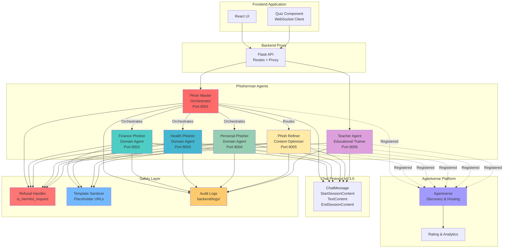
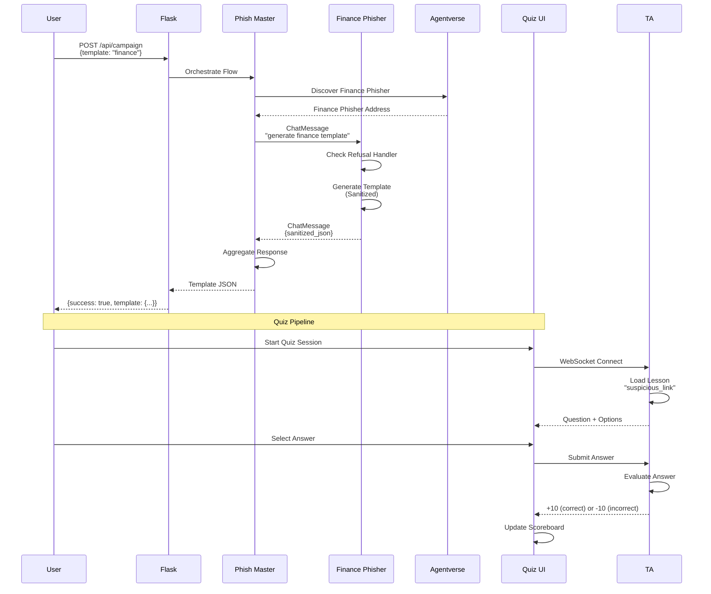
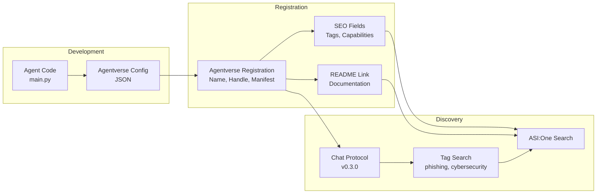
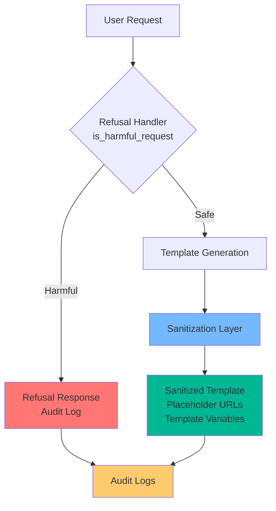

# Phisherman Architecture Diagram

**Multi-agent system using Fetch.ai uAgents and Agentverse**

---

## System Architecture



---

## Message Flow Sequence



---

## Agent Registration Flow



---

## Safety Architecture



---

## Technology Stack

```
┌─────────────────────────────────────────┐
│         Frontend (React)                │
│  - Quiz Component (WebSocket)          │
│  - Dashboard UI                        │
└─────────────────────────────────────────┘
                    ↓
┌─────────────────────────────────────────┐
│      Backend Proxy (Flask)              │
│  - /api/campaign (POST)                 │
│  - /api/completion (POST)              │
│  - Error Handling & Logging            │
└─────────────────────────────────────────┘
                    ↓
┌─────────────────────────────────────────┐
│     uAgents Framework                    │
│  - Agent(name="...")                    │
│  - Protocol()                           │
│  - ChatMessage handlers                 │
└─────────────────────────────────────────┘
                    ↓
┌─────────────────────────────────────────┐
│   Chat Protocol v0.3.0                  │
│  - StartSessionContent                  │
│  - TextContent                          │
│  - EndSessionContent                    │
└─────────────────────────────────────────┘
                    ↓
┌─────────────────────────────────────────┐
│      Agentverse Platform                │
│  - Hosted Agents                        │
│  - Discovery & Search                   │
│  - Rating & Analytics                   │
└─────────────────────────────────────────┘
```

---

## Component Descriptions

### Orchestrator Layer
- **Phish Master**: Routes requests to domain agents, aggregates responses

### Domain Agents
- **Finance Phisher**: Banking, payment verification scenarios
- **Health Phisher**: Medical records, insurance scenarios
- **Personal Phisher**: Social media, password reset scenarios

### Specialized Agents
- **Phish Refiner**: Content optimization, urgency adjustment
- **Teacher Agent**: Educational lessons, quiz pipeline

### Infrastructure
- **Agentverse**: Discovery, hosting, analytics
- **Chat Protocol**: Standardized message format
- **Safety Layer**: Refusal handlers, sanitization, audit logs

---

## Key Design Principles

1. **Separation of Concerns**: Each agent has a single responsibility
2. **Protocol Compliance**: All agents use Chat Protocol v0.3.0
3. **Safety First**: Refusal paths, sanitized outputs, audit logs
4. **Interoperability**: Standard endpoints enable cross-agent communication
5. **Observability**: Comprehensive logging and analytics

---

**Diagram Export**: Use Mermaid Live Editor (https://mermaid.live) to render as PNG/SVG

